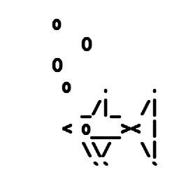

% Test file
% Author
% 02.09.2020

Heading A
==================

Subheading 1
------------------

Lorem ipsum dolor sit amet, consectetur adipisici elit, sed eiusmod tempor incidunt ut labore et dolore magna aliqua. Ut enim ad minim veniam, quis nostrud exercitation ullamco laboris nisi ut aliquid ex ea commodi consequat. Quis aute iure reprehenderit in voluptate velit esse cillum dolore eu fugiat nulla pariatur. Excepteur sint obcaecat cupiditat non proident, sunt in culpa qui officia deserunt mollit anim id est laborum.

Subheading 2
------------------

Lorem ipsum dolor sit amet, consectetur adipisici elit, sed eiusmod tempor incidunt ut labore et dolore magna aliqua. Ut enim ad minim veniam, quis nostrud exercitation ullamco laboris nisi ut aliquid ex ea commodi consequat. Quis aute iure reprehenderit in voluptate velit esse cillum dolore eu fugiat nulla pariatur. Excepteur sint obcaecat cupiditat non proident, sunt in culpa qui officia deserunt mollit anim id est laborum.

Another  subheading
--------------------

This time with a list.

* bla
* bla
* bla
* foo

Heading B
===============

Subheading 1
------------------

Lorem ipsum dolor sit amet, consectetur adipisici elit, sed eiusmod tempor incidunt ut labore et dolore magna aliqua. Ut enim ad minim veniam, quis nostrud exercitation ullamco laboris nisi ut aliquid ex ea commodi consequat. Quis aute iure reprehenderit in voluptate velit esse cillum dolore eu fugiat nulla pariatur. Excepteur sint obcaecat cupiditat non proident, sunt in culpa qui officia deserunt mollit anim id est laborum.

~~~~~~~~~~~~~
#1 = Abc($,$,$);
#2 = Def(#1,3,4,$);
#3 = Geh(("abc","def"));
~~~~~~~~~~~~~

Subheading 2
------------------

Lorem ipsum dolor sit amet, consectetur adipisici elit, sed eiusmod tempor incidunt ut labore et dolore magna aliqua. Ut enim ad minim veniam, quis nostrud exercitation ullamco laboris nisi ut aliquid ex ea commodi consequat. Quis aute iure reprehenderit in voluptate velit esse cillum dolore eu fugiat nulla pariatur. Excepteur sint obcaecat cupiditat non proident, sunt in culpa qui officia deserunt mollit anim id est laborum.

{#fig:fish width=3cm}

See Figure \ref{fig:fish}.

Heading C
=============

Math
------

Try some math.
Given two points $P_1 = (\varphi_1, \varphi_2), P_2 = (\varphi_2, \lambda_2)$ apply the following:

$$
x_N = \cos \varphi_1 * \sin \varphi_2 - \sin(\varphi_1) * \cos(\varphi_2) * \cos(\lambda_2-\lambda_1)   
$$

Citation
-----------

@Dominici2014 wrote a nice overview on Pandoc.

References {-}
==================

